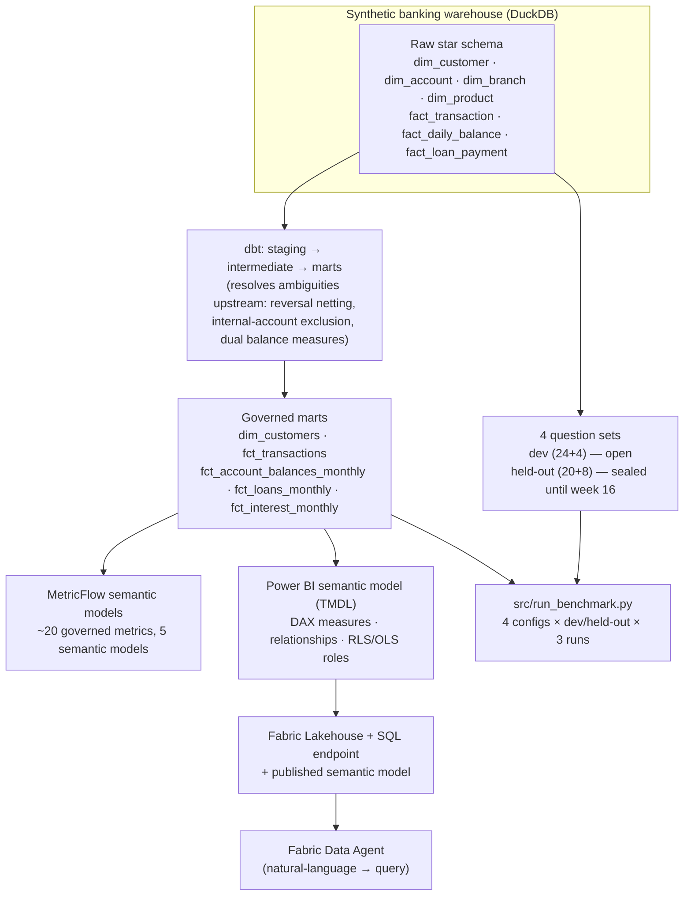

# taylan-semantic-ai-lab

A reproducible benchmark: does a governed semantic layer actually make an AI
agent more accurate and safer to query — and does it survive contact with a
real AI product, not just a controlled prompt test?

Built on a synthetic banking DuckDB warehouse seeded with **8 deliberate
metric ambiguities** (gross vs. net revenue, posting vs. transaction date,
written-off loans, and five others — see [the ambiguity
register](docs/ambiguity-register.md)). Four query configurations, a sealed
held-out evaluation set, a real Microsoft Fabric Data Agent, and Power BI
row-/object-level security are all benchmarked against the same warehouse.

**Status:** core benchmark complete (weeks 1–16 of a 24-week build). DP-600
certification and publish/apply phase (weeks 17–18) in progress.

## The two-part finding

1. **Metadata quality matters a lot for raw text-to-SQL accuracy** — but not
   in the direction a naive "governance always wins" story would predict. See
   [reports/week16-benchmark.md](reports/week16-benchmark.md).
2. **None of that matters if the AI product layer doesn't reliably route
   through the governed semantic model in the first place.** A real Fabric
   Data Agent, wired to the exact same governed model, scored *worse than the
   ungoverned baseline* and silently bypassed row-/object-level security
   entirely. See [reports/fabric-data-agent-dev-results.md](reports/fabric-data-agent-dev-results.md)
   and [reports/week15-security-rls-ols.md](reports/week15-security-rls-ols.md).

The second finding is the more important one. A correctly governed semantic
layer is necessary but not sufficient — it has to be independently verified
that the AI layer on top actually uses it.

## Architecture



## What's in this repo

| Path | What it is |
|---|---|
| `src/build_warehouse.py` | Deterministic warehouse generator (seeded RNG) — the raw star schema plus all 8 ambiguities |
| `models/` | dbt: `staging/` (source-conformed) → `intermediate/` → `marts/` (governed, business-facing) |
| `semantic/*.yml` | MetricFlow semantic models — ~20 governed metrics across 5 domains |
| `powerbi/Banking_Lakehouse.*` | Power BI project in PBIP/TMDL (version-controlled as text) — DAX measures, relationships, 4 RLS/OLS security roles |
| `evals/` | The 4 question sets — see [Question sets & sealing](#question-sets--sealing) |
| `docs/ambiguity-register.md` | All 8 seeded ambiguities: both readings, business meaning, how to detect a wrong answer |
| `docs/adr-001-lakehouse-vs-warehouse.md` | Architecture decision record (Fabric Lakehouse vs. Warehouse), amended after real Direct Lake reliability problems |
| `src/run_baseline.py` | Week 6: raw-schema baseline (no semantic layer), dev set only |
| `src/run_metadata_ab.py` | Week 13: poor-metadata vs. AI-ready-metadata A/B test on governed marts, dev set only |
| `src/run_benchmark.py` | Week 16: the full 4-configuration benchmark against dev **and** held-out |
| `reports/` | Every benchmark's numeric results and write-up |
| `tests/` | pytest: warehouse sanity, dev-set SQL reproducibility, question-plan validation |
| `.github/workflows/ci.yml` | Runs the test suite, rebuilds the warehouse, and runs `dbt build`/`dbt docs generate` on every push |

## Question sets & sealing

| File | Count | Status |
|---|---|---|
| `evals/dev.yaml` | 24 in-scope | open — iterated against freely, weeks 1–15 |
| `evals/dev_out_of_scope.yaml` | 4 unanswerable | open |
| `evals/holdout.yaml` | 20 in-scope | **sealed** from generation (week 3–5) until opened for the first time in week 16 |
| `evals/out_of_scope.yaml` | 8 unanswerable | **sealed**, same discipline |

Every in-scope question is tagged with one of the 8 ambiguities and has a
verified `expected_result`, computed directly against the warehouse at
generation time. Sealing discipline was verified, not just asserted: dev-set
accuracy tracked held-out accuracy within a few points for every
configuration in week 16 — the numbers generalized, which is the actual
evidence the sealing held.

## Benchmark protocol & results (week 16)

One command reproduces every number:

```
python src/run_benchmark.py
```

4 configurations, run against dev and held-out (in-scope and out-of-scope),
3 runs each, 672 total model calls, one deterministic comparison function
(numeric near-match against a documented tolerance; no LLM-judge scoring).

| Config | Dev in-scope accuracy | Held-out in-scope accuracy | Held-out OOS refusal rate |
|---|---|---|---|
| 1. Raw schema | 31.9% | 33.3% | 100% |
| 2. Raw schema + business glossary | **69.4%** | **70.0%** | 100% |
| 3. Governed semantic model | 26.4% | 23.3% | 100% |
| 4. Governed + AI-ready metadata | 50.0% | 48.3% | 100% |

**Raw schema + glossary outperformed the governed configurations.** Root
cause, broken down by ambiguity tag in
[reports/week16-benchmark.md](reports/week16-benchmark.md): two of the eight
ambiguity categories (reversed transactions, internal accounts) are
*structurally* unanswerable from the governed marts — that data is
deliberately excluded upstream in dbt, so any question asking for the
excluded reading has no correct governed answer to give, regardless of
metadata quality. Even accounting for that, a plainly-worded glossary
out-performed more abstract AI-ready metadata on at least one ambiguity
(gross vs. net revenue) because it explicitly stated a mechanical detail
(the sign convention on a signed column) that the richer metadata only
implied. The full write-up treats this as an honest, examined result, not
something to explain away.

## The Fabric Data Agent (week 14) and security (week 15)

A real `banking_data_agent` was built on Microsoft Fabric, connected to both
the raw Lakehouse tables and the governed Power BI semantic model (with its
DAX measures), and tested against the full 24-question dev set plus
follow-up/filter/time-comparison prompts.

**Result: 1/24 in-scope accuracy (4.2%) — worse than the ungoverned week 6
baseline.** Root-caused via the agent's diagnostic export: its default tool
routing generates raw T-SQL directly against the Lakehouse SQL endpoint,
bypassing the connected semantic model (and its governed DAX measures)
entirely — confirmed via a diagnostic JSON export, and confirmed to be a
platform routing behavior, not a prompt-engineering gap (tightening
instructions and restricting the agent to the semantic model as its only
data source both had zero effect).

That same routing bypass has a second, more serious consequence: **row- and
object-level security defined on the semantic model — verified working
correctly in Power BI Desktop — is silently bypassed when the same model is
queried through the Data Agent.** A user assigned to the most-restricted of
4 security roles got an unfiltered, unrestricted answer through the agent,
identical to what an unrestricted user would see. Full findings:
[reports/fabric-data-agent-dev-results.md](reports/fabric-data-agent-dev-results.md)
and [reports/week15-security-rls-ols.md](reports/week15-security-rls-ols.md).

## Scope limitations

- `dim_customer.is_active` (the "active vs. open account" ambiguity) is a
  precomputed column, not derived live from transaction recency — this
  narrows what that specific ambiguity actually tests (column selection,
  not behavioral derivation). Documented in the ambiguity register.
- The governed dbt marts structurally exclude reversed-transaction
  identifiers and internal/GL accounts upstream — by design, but it means
  two ambiguity categories are mechanically unanswerable under the governed
  configurations regardless of AI metadata quality.
- The benchmark tests direct Claude API text-to-SQL against DuckDB (weeks 6,
  13, 16) separately from the real Fabric Data Agent product (weeks 14–15)
  — they are not the same execution path, and the Fabric result is
  substantially worse. Both are reported; neither should be read as
  representing the other.
- Interest/NII/NIM figures use a simplified, non-amortizing interest model,
  not real loan amortization schedules.
- One model version, one reasoning setting throughout each benchmark run —
  results are specific to that model and are expected to shift with a
  different model or version.

## Setup

```
python -m venv .venv
.venv\Scripts\activate
pip install -r requirements.txt
copy .env.example .env   # then add your ANTHROPIC_API_KEY

python src/build_warehouse.py       # builds warehouse.duckdb
dbt build --profiles-dir .          # builds the governed marts
pytest -v                           # full test suite
```

Reproduce any benchmark:

```
python src/run_baseline.py          # week 6: raw-schema baseline (dev only)
python src/run_metadata_ab.py       # week 13: metadata A/B test (dev only)
python src/run_benchmark.py         # week 16: full 4-config benchmark (dev + held-out)
```

`evals/holdout.yaml` and `evals/out_of_scope.yaml` are included in the repo
as-is (already unsealed) — no special setup needed to reproduce the week 16
numbers.

CI (`.github/workflows/ci.yml`) runs the full test suite, rebuilds the
warehouse from scratch, and runs `dbt build` + `dbt docs generate` on every
push.
